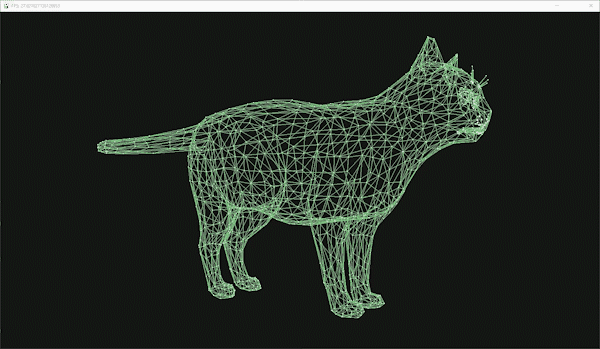

<h1>Utility to compile a folder of images into a gif</h1>

Basic usage:

    $ makegif [options] [output_filename (optional)]

Options:
      
      -h, --help            show help message and exit
      -i INPUT, --input=INPUT
                            Input folder
                            default: ./input/
      -o OUTPUT, --output=OUTPUT
                            Output folder
                            default: ./output/
      -e X, --every=X
                            Only use every Xth image
                            default: 1
      -s SPEED, --speed=SPEED
                            Speed of gif (higher is faster)
                            default: 4 (i.e. 100ms per frame)

Based on example code at https://github.com/benjaminadk/gif-encoder-2